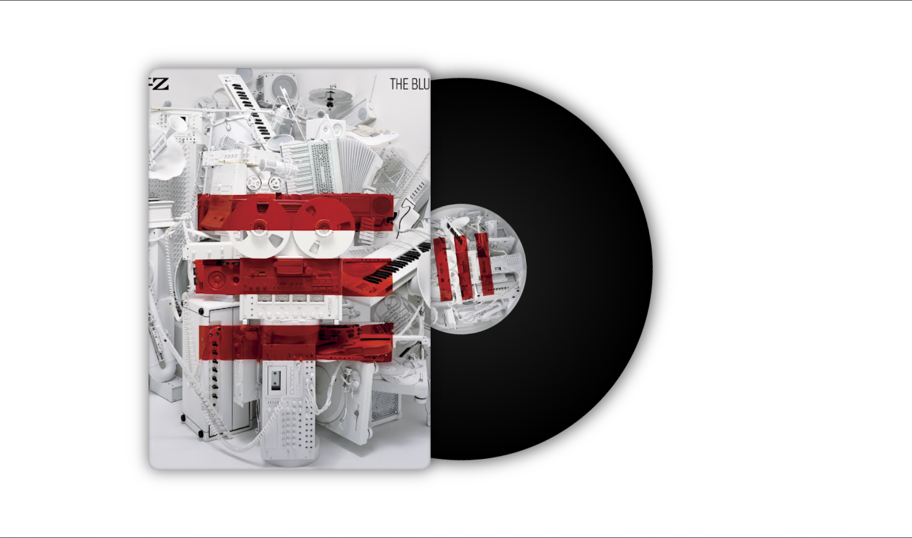

# NowPlayingAPI 

Track your currently playing YouTube Music songs
## Overview
**Components:**
- Express.js backend API
- Chrome extension for automatic song tracking
- Animated vinyl record frontend visualization



## Features

- Real-time song tracking from YouTube Music
- RESTful API
- Chrome extension

## Tech Stack

Express.js • Node.js • HTML5 • CSS3 • JavaScript

## Quick Start
```bash
# Clone and install
git clone https://github.com/RistoT1/NowPlayingAPI
cd NowPlayingAPI/server
npm install

# Start server
npm start
```

Server runs on `http://localhost:3001` by default

## Setup Guide

### 1. Backend Server
```bash
cd server
npm install    # Downloads all required packages (Express.js, etc.)
npm start      # Starts the Express server on port 3001
```

**Server Configuration:**
- Default port: `3001`
- To change port: Edit `PORT` variable in `server/index.js`
- Access at: `http://localhost:3001`

**Endpoints:**
- `GET /nowplaying` - Fetch current song
- `POST /nowplaying` - Update current song

### 2. Chrome Extension

**Option A - Browser Console:**
1. Open [YouTube Music](https://music.youtube.com)
2. Press `F12` → Console
3. Paste code from `extension/userscript.js`

**Option B - Chrome Extension (Recommended):**
1. Go to `chrome://extensions/`
2. Enable **Developer Mode**
3. Click **Load unpacked** → select `extension/` folder
4. Open YouTube Music

### 3. Frontend Visualization

1. Update API URL in `frontend/index.html`:
```javascript
const API_URL = "http://localhost:3001/nowplaying";
```

2. Open `frontend/index.html` in browser

## API Documentation

**GET /nowplaying**
```json
{
  "title": "Blinding Lights",
  "artist": "The Weeknd",
  "thumbnail": "https://i.ytimg.com/vi/4NRXx6U8ABQ/maxresdefault.jpg",
  "updated": 1698034567890
}
```

**POST /nowplaying**
```json
{
  "title": "Song Title",
  "artist": "Artist Name",
  "thumbnail": "https://thumbnail-url.jpg"
}
```

## Deployment

**Backend:** [Render](https://render.com) • [Railway](https://railway.app)

**Frontend:** [Netlify](https://netlify.com) • [GitHub Pages](https://pages.github.com)

Don't forget to update the API URL in `extension & index.html` after deploying!
**remember to asing env key for the deploying if you want your api to be secure**
## Project Structure
```
NowplayingApi/
├── server/              # Express.js backend
│   ├── index.js         # Server runs on port 3001
│   └── package.json     # Lists dependencies for npm install
├── extension/           # Chrome extension & userscript
├── frontend/            # Vinyl visualization
│   └── index.html
└── README.md
```

[live demo can be seen in my portfolio](https://webportfolio-rt.netlify.app/#home)
